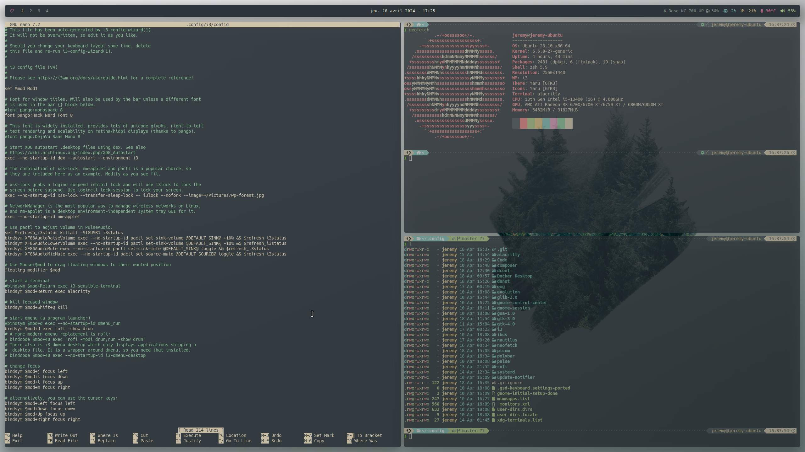
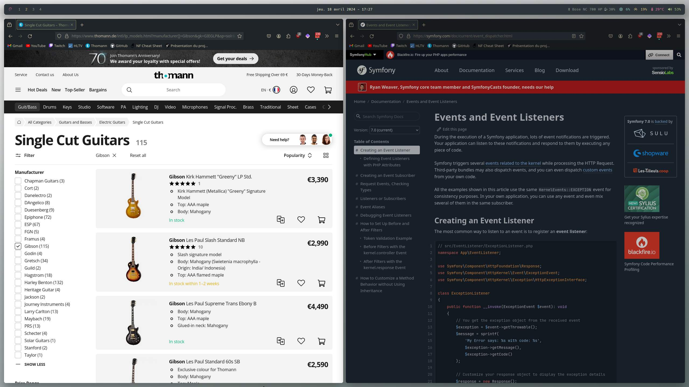
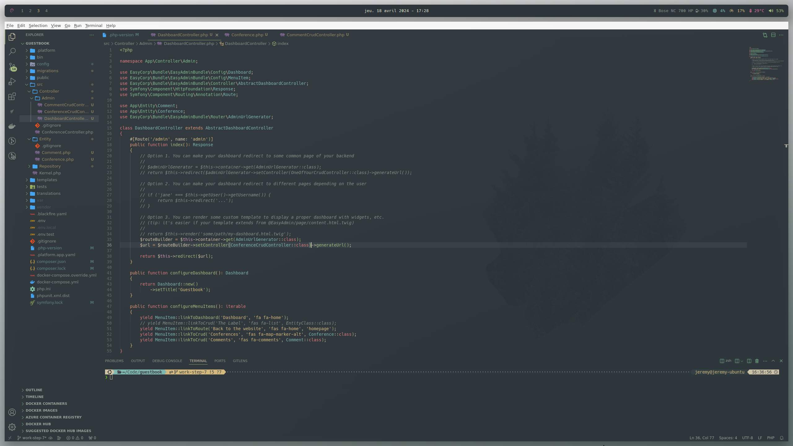
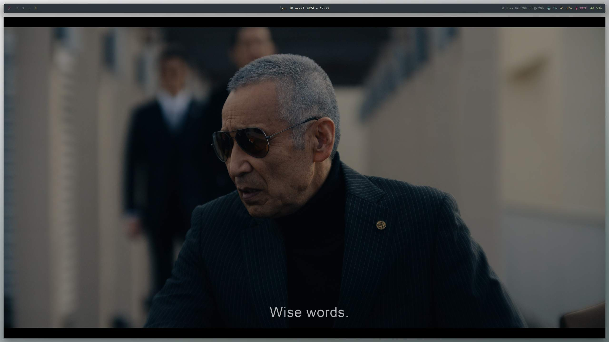
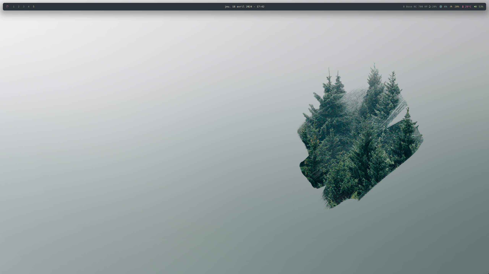

# Ubuntu i3 rice

Custom rice on Ubuntu 23.10 with mixes of Everforest and Catppuccin themes.

## Specs

* **OS:** Ubuntu 23.10
* **Shell:** zsh
* **WM:** i3
* **Terminal:** Alacritty
* **Launcher:** Rofi
* **Bar:** Polybar
* **Compositor:** Picom
* **Wallpaper:** [available here](pictures/wallpaper.jpg)

### In progress

* Make clicks work in Polybar scripts
* Fix rounded borders black pixels in various apps (Spotify, Stremio etc)
* Improve Dunst notifications look

## Screenshots

