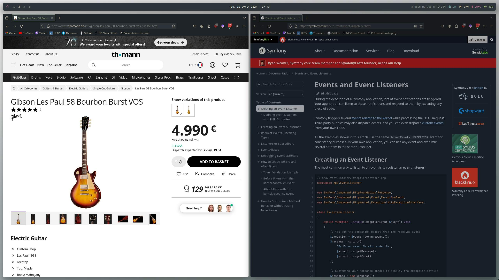

# Ubuntu i3 rice

Custom rice on Ubuntu 23.10 with mixes of Everforest and Catppuccin themes.

## Specs

* **OS:** Ubuntu 23.10
* **Shell:** zsh
* **WM:** i3
* **Terminal:** Alacritty
* **Launcher:** Rofi
* **Bar:** Polybar
* **Compositor:** Picom
* **Wallpaper:** [available here](https://github.com/jeremykervran/dotfiles-ubuntu/pictures/wallpaper.jpg)

### In progress

* Add Spotify script for Polybar
* Improve Dunst notifications look

## Screenshots

